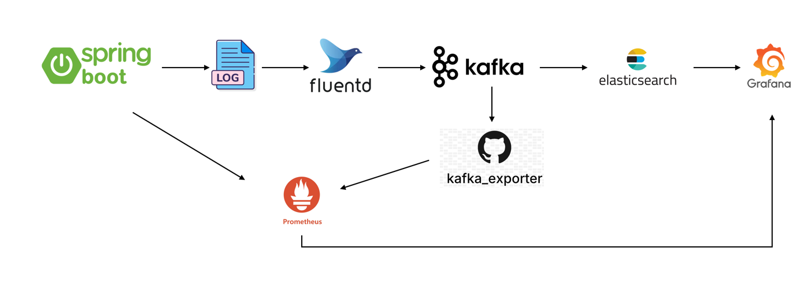

# 사전과제
--- 

# # 프로젝트 설명
이 프로젝트는 Spring Boot를 기반으로 한 도서 검색 애플리케이션입니다.

## 구현 사항
### 필수 기능
- [x] 도서 카탈로그 조회(Offset, Cursor 기반 페이징) API
- [x] 도서 상세 정보 조회 API
- [x] 단순 검색 및 복합 검색 API
  - [x] 연산자 사용 복합 검색 기능
  - [x] 검색 결과 페이징
- [x] 인기 검색어 조회 API

### 추가 기능
다음 추가 기능을 구현했습니다.
- [x] 도서 카탈로그 조회 무한 스크롤
- [x] API를 테스트할 수 있는 웹 인터페이스
- [x] 캐싱 메커니즘 구현
  - Redis
- [x] API 인증(JWT 기반) 및 인가 기능
  - Spring Security
  - JWT
- [x] 로깅 및 모니터링
  - fluentd, kafka, elsaticsearch, prometheus, grafana, spring actuator, kafka exporter 
- [x] 인기 검색어 스냅샷 저장 배치 
- [x] 회원가입 API

### 구현 특이사항
- 외부요소의 변경에 강한 헥사고날 아키텍처를 채택했습니다.
  - 도메인 모델과 비즈니스 로직을 중심으로 외부 시스템(데이터베이스, 캐시, 메시징 시스템 등)과의 의존성을 최소화했습니다.
- 검색 시 이벤트를 발행하여 비동기적으로 인기 검색어를 업데이트합니다.
  - 별도의 consumer 서비스를 구현해 Kafka message를 수신하고, 인기 검색어를 업데이트합니다.
  - Redis 장애 또는 컨슈머 처리 중 예외 발생 시 Kafka Consumer는 재시도를 3회 수행하고, 이후에도 실패할 경우 Dead Letter Topic에 메시지를 저장합니다.
    -  Dead Letter Topic에 저장된 메시지를 모니터링하고, 재처리에 활용할 수 있습니다.
- Redis 장애를 대비해 RDB에 인기 검색어 스냅샷을 저장할 수 있는 배치를 개발 했습니다.
  - 일정 주기마다 배치를 실행시켜 인기 검색어를 RDB에 저장하고, Redis 장애 시 데이터 복구, 백업 전략으로 활용 가능하도록 했습니다.

### 검색 엔진
검색 기능은 MySQL의 LIKE 쿼리를 사용해 구현했습니다. 추후 Elasticsearch를 활용한 구현체를 구현하여 대체할 수 있습니다.
현재는 QueryDSL을 사용하는 **QuerydslSearchEngine**이 구현되어 있으며 검색 연산자를 지원합니다. 

**QuerydslSearchEngine**
쿼리를 파싱하고, 검색 조건에 따라 검색을 실행하며, 결과를 집계합니다.
Function<JPAQueryFactory, JPAQuery<?>>타입의 함수형인터페이스를 필드로 가지며, 쿼리를 외부에서 전달하여 검색 기능을 구현할 수 있게 하여 재사용성, 확장성을 높였습니다.
기본 쿼리를 제공하면 검색어에 따른 조건을 추가한 쿼리를 자동 생성하고, 페이징을 위한 카운트 쿼리를 자동 생성합니다.

**QueryParser**
검색어를 파싱하는 인터페이스로, 키워드와 연산자를 추출기능을 구현합니다.

**SearchOperator & SearchPredicateApplier**
검색 연산자 인터페이스와 조건문을 적용하는 함수형 인터페이스입니다.
인터페이스를 구현해 연산자와 그에 대한 처리를 확장할 수 있게 구현했습니다.

```java
  Map<SearchOperator, SearchPredicateApplier> operatorMap = Map.of(
        SearchOperatorType.NO_OPERATOR, (booleanBuilder, keyword) -> booleanBuilder.or(QBookEntity.bookEntity.title.like("%" + keyword + "%")),
        SearchOperatorType.OR_OPERATOR, (booleanBuilder, keyword) -> booleanBuilder.or(QBookEntity.bookEntity.title.like("%" + keyword + "%")),
        SearchOperatorType.NOT_OPERATOR, (booleanBuilder, keyword) -> booleanBuilder.and(QBookEntity.bookEntity.title.notLike("%" + keyword + "%"))
);
```


## 시스템 아키텍처


### 로깅 및 모니터링


# 도메인 모델 설명
Book, Author, Publisher, User 도메인 모델의 정의했습니다. 각각 별도의 테이블로 관리되며 Aggregate Root간 단방향 간접 참조로 연관관계를 맺습니다.
## 모델 속성
### 📖 Book (도서)

설명: 책을 표현하는 도메인 모델, 

주요 속성

| 속성명           | 설명            | 제약 조건                    |
| ------------- | ------------- | ------------------------ |
| `id`          | 도서 식별자 (UUID) | 시스템에서 자동 생성              |
| `isbn`        | 도서 고유 번호      | ISBN-10 또는 ISBN-13 형식 필수 |
| `title`       | 책 제목          | 필수, 공백 불가(최대 100자)                |
| `subtitle`    | 부제            | 선택, 공백 시 null(최대 100자)            |
| `image`       | 표지 이미지        | 선택                       |
| `authorId`    | 저자 ID         | 필수                       |
| `publisherId` | 출판사 ID        | 필수                       |
| `published`   | 출판일           | 선택                       |
| `auditInfo`   | 생성자/수정자/시간 기록 | 자동 관리                    |


### 👤 Author (저자)

설명: 책을 집필한 저자를 표현하는 엔티티

주요 속성

| 속성명         | 설명            | 제약 조건       |
| ----------- | ------------- | ----------- |
| `id`        | 저자 식별자 (UUID) | 시스템에서 자동 생성 |
| `name`      | 저자 이름         | 필수, 공백 불가(최대 100자)   |
| `auditInfo` | 생성/수정 이력      | 자동 관리       |


### 🏢 Publisher (출판사)

설명: 출판사 도메인 모델

주요 속성

| 속성명         | 설명             | 제약 조건       |
| ----------- | -------------- |-------------|
| `id`        | 출판사 식별자 (UUID) | 시스템에서 자동 생성 |
| `name`      | 출판사명           | 필수(최대 100자) |
| `auditInfo` | 생성/수정 이력       | 자동 관리       |


### 👥 User (사용자)

설명: 사용자 도메인 모델

| 속성명         | 설명                            | 제약 조건       |
| ----------- | ----------------------------- |-------------|
| `id`        | 사용자 식별자 (UUID)                | 시스템에서 자동 생성 |
| `username`  | 로그인 ID                        | 필수(4 ~ 20자) |
| `password`  | 암호화된 비밀번호                     | 필수          |
| `role`      | 권한(ROLE\_USER, ROLE\_ADMIN 등) | 필수          |
| `auditInfo` | 생성/수정 이력                      | 자동 관리       |


### 🔢 Isbn (ISBN 값 객체)

설명: 책 고유 식별 번호 (값 객체)

특징

ISBN-10 (\d{9}[0-9X]) 또는 ISBN-13 (97[89]\d{10})만 허용한다.

- 불변(Immutable) 객체로 생성 후 값 변경 불가.

도메인 규칙

- 잘못된 ISBN 문자열은 생성 시 예외 발생.

- 랜덤 ISBN-13 생성 기능 제공.

## 연관 관계
Book ↔ Author
- 관계 유형: 다대일(N:1)
- 한 명의 저자는 여러 권의 책을 집필할 수 있다.
- 각 책은 반드시 하나의 저자에 속해야 한다.

Book ↔ Publisher
- 관계 유형: 다대일(N:1)
- 한 출판사는 여러 권의 책을 발행할 수 있다.
- 각 책은 반드시 하나의 출판사에 속해야 한다.

Author ↔ Book
- 관계 유형: 일대다(1:N)
- 저자는 다수의 책과 연결될 수 있다.

Publisher ↔ Book
- 관계 유형: 일대다(1:N)
- 출판사는 다수의 책과 연결될 수 있다.

User
- 현재 도메인 모델에서 직접적인 엔티티 연관관계는 없다.
- 대신 시스템 내에서 인증/인가를 담당하며, Book, Author, Publisher 데이터를 관리하거나 접근하는 역할을 가진다.


# # 실행 방법

## Docker 환경에서 실행
make file을 실행시켜 Spring Boot 애플리케이션을 빌드해 도커 이미지를 생성하고, docker-compose를 실행 시킵니다.
```bash
 make
```

다른 컨테이너에 의존성을 갖고있는 컨테이너의 경우 해당 컨테이너가 완전히 실행 된 후 실행 가능합니다.(ex: book-api -> redis,mysql)

커넥션 에러 등으로 컨테이너가 종료된 경우 의존하는 컨테이너가 완전히 실행된 후 다시 컨테이너를 시작해주세요.
```bash
docker-compose up -d book-api
또는
docker-compose up -d kafka-exporter
```


#### Docker-Compose 구성
- kafka cluster(KRAFT)
- Redis
- mysql
- spring boot application
  - book-api
  - book-web
  - keyword-consumer-service
- grafana
- prometheus
- kafka-exporter
- elasticsearch
- kafka-connect

## 테스트 용 Book-Web
도커 컴포즈로 Spring Boot 애플리케이션을 실행한 후, Book-Web을 통해 구현 기능들을 테스트할 수 있습니다.

1. Book-Web 로그인 페이지로 접속
http://localhost:8081/signin
2. 로그인(id: test, passoword: test)
3. 리다이렉트된 도서 카탈로그 페이지에서 구현 기능 테스트

## 로그 및 시스템 모니터링
Grafana에 접속

http://localhost:3000

Dashboard or Explore 확인
- 카프카 모니터링
  - Dashboards -> Kafka Exporter Overview
- Spring Boot Application 모니터링
  - Dashboards -> Spring Boot 3.x Statistics
- 로그 조회
  - Explore -> Query type -> Logs

# # API 문서
spring boot application(book-api)을 실행한 후 swagger를 통해 API 문서를 확인할 수 있습니다.

http://localhost:8082/swagger-ui/index.html

**인증**

API를 이용하기 위해서는 access token이 필요합니다.
미리 생성된 테스트용 계정을 사용해 Sign-in API를 호출하여 access token을 발급 받습니다.

```
id: test
password: test
```

발급 받은 access token을 복사하여 Swagger 페이지 우측 상단 "Authorize" 버튼을 클릭하여 입력합니다.

이 후 API를 호출 할 수 있습니다.

# # 기술 스택 및 선택 이유
## Web Application(API Server & Front Client Server)
- Spring Boot 3, Java 21
  - Java 와 Spring Boot는 가장 익숙하게 사용해오던 언어와 프레임워크로 풍부한 기능과 생태계 지원으로 빠른 개발이 가능하며, RESTful API를 쉽게 구현할 수 있습니다.
  - 특히 Java 21은 LTS(장기 지원) 버전으로 안정성과 보안 업데이트를 제공합니다.
- thymeleaf
  - Spring MVC + thymeleaf는 서버 사이드 템플릿 엔진으로, HTML을 동적으로 생성할 수 있어 프론트엔드 개발에 유용합니다.
    간단한 테스트용 클라이언트 구현에 적합하여 채택했습니다.

## Database
- MYSQL
  - MySQL은 오랜 시간 동안 안정성과 성능을 입증한 관계형 데이터베이스로, Spring Boot와의 통합이 용이합니다.
도서 정보와 같은 구조화된 데이터를 저장하고 관리하는 데 적합하여 채택했습니다.

## ORM
JPA(QueryDSL)
- JPA는 객체 관계 매핑(ORM) 프레임워크로, 데이터베이스와의 상호작용을 객체 지향적으로 처리할 수 있습니다.
- QueryDSL은 타입 안전한 쿼리 생성을 지원하여, 복잡한 쿼리를 작성할 때 컴파일 타임에 오류를 잡을 수 있어 유지보수성과 가독성을 높이는 데 유리합니다.


## Cache
- Redis
  - Redis는 인메모리 데이터 저장소로, 빠른 읽기/쓰기 성능을 제공합니다.
  - AOF/RDB 방식으로 데이터를 영속화할 수 있어 장애 발생 시 데이터 복구가 가능합니다.
  - Redis Cluster를 구성하여 고가용성과 확장성을 확보할 수 있으며, 도서 검색 결과 캐싱 및 인기 검색어 저장에 적합하여 채택했습니다.

## Message Broker
- Kafka

Kafka는 분산 메시징 시스템으로, 높은 처리량과 내결함성을 제공합니다.
1. 비동기 이벤트 처리
도서 검색 이벤트를 비동기적으로 처리하고, 인기 검색어 업데이트를 위한 이벤트 기반 아키텍처를 구현하는 데 적합합니다.
2. DLT
DLT(Dead Letter Topic) 기능을 활용해 장애 발생시 메시지를 유연하고 안전하게 처리할 수 있습니다.
3. 확장성
클러스터 구성을 통해 높은 확장성을 제공하여 늘어나는 트래픽에 유연하게 대처할 수 있습니다.
4. 로깅
Kafka를 로깅 시스템의 메시지 브로커로 사용하여 로그 데이터를 수집하고, 다른 시스템으로 전송하는 데 적합합니다.
pull 기반으로 로그를 수집할 수 있어, 로그 수집 시스템의 부하를 줄일 수 있습니다.

## Logging & Monitoring
- Prometheus
  - 시계열 데이터(time-series) 기반의 모니터링에 최적화되어 있으며, Spring Actuator, Kafka Exporter 등과 통합이 용이하여 채택했습니다.
- Fluentd
  - 로그 수집 및 전송을 위한 유연한 데이터 파이프라인을 제공하며, Kafka와 Elasticsearch로 로그를 전송하는 데 적합합니다.
  JVM 기반으로 동작되는 Logstash와 비교했을 때, 가벼운 리소스 사용으로 컨테이너 환경에서 적합하다는 점이 장점으로 보여 채택했습니다. 
- Grafana
  - Elasticsearch, Prometheus와 통합하여 수집된 메트릭을 시각화하는 데 용이합니다.
  - 오픈 소스이며, 대시보드, 플러그인이 풍부합니다.
  - Kibana와 비교했을 때, Kibana 보다 Prometheus와 Elasticsearch 모두 통합하여 사용하기 용이하여 채택했습니다. 
- Kafka Exporter
  - Kafka의 메트릭을 수집하여 Prometheus로 전송하여 모니터링하기 위해 채택했습니다.
- Spring Actuator
  - Spring Boot 애플리케이션의 상태, 메트릭, 헬스 체크 등을 제공하여 Prometheus로 메트릭을 수집하는 데 사용하기위해 채택했습니다.
- Kafka & Kafka Connect(ElasticsearchConnect)
  -  Fluentd로 수집한 로그를 Kafka에 저장하고, Kafka Connect를 통해 Elasticsearch로 전송하여 로그 데이터를 인덱싱하고 검색할 수 있도록 하기 위해 채택했습니다.
  -  버퍼 및 백프레셔 역할을 하여 대규모 트래픽을 가정했을 때 elastiscsearch의 부하를 줄이고, 장애 발생 시에도 로그 데이터를 안전하게 저장할 수 있어 채택했습니다.
- Elasticsearch
  - 수집된 로그 데이터를 인덱싱하고 검색할 수 있는 강력한 검색 엔진으로, 대량의 로그 데이터를 효율적으로 처리할 수 있습니다.
  - 현재는 DB Query 기반의 검색을 하지만, 향후 Elasticsearch를 활용한 검색 기능 구현을 고려했을 때 적합하여 채택했습니다.

## 인증 및 인가
- Spring Security
  - Spring Boot 애플리케이션에 인증 및 인가 기능을 쉽게 통합할 수 있습니다.
- JWT
  - JSON Web Token을 사용하여 Stateless한 인증을 구현할 수 있습니다.
  - 세션을 사용하지 않고, 클라이언트 측에서 토큰을 관리하여 서버의 부하를 줄일 수 있습니다.
  - 분산 시스템 환경에서 확장성이 뛰어납니다.

# 아키텍처 결정사항
## 검색 이벤트 처리
처음에는 인기 검색어 조회 기능을 구현하기 위해 검색 후 캐시에 바로 저장하는 방식을 고려했습니다.

하지만, 검색 데이터의 경우, 인기 검색어 업데이트 외에도 사용자, 검색 트렌드 분석, 통계 수집 등 다양한 부분에서 활용될 수 있을 것으로 보였습니다.

따라서, 그러한 추가 요구사항을 확장하기 위해서는 검색 이벤트를 발행하고, 이를 비동기적으로 처리하는 방식이 더 유연하고 확장성이 높다고 판단했습니다.

이를 위해 도서 검색 시 이벤트를 발행하고, 이를 처리하는 별도의 Kafka Consumer Service를 구현했습니다.

kafka consumer 구현 시 두 가지를 추가로 고려했습니다.
1. book-api에서 직접 컨슈머 생성
2. **별도의 컨슈머 서비스 생성**

1번 방법은 book-api에서 검색 이벤트를 발행하고, 이를 book-api에서 직접 컨슈머를 생성하여 처리하는 방식입니다.

book-api의 배포에 따른 consumer의 메시지 처리의 단절이 생기며, 컨슈머 파티션의 재배치가 발생하는 등의 문제가 발생할 수 있을것으로 보였습니다.

또한 컨슈머의 처리량 확보가 필요한 경우 파티션을 늘려야하며 그에따라 애플리케이션 노드(컨슈머)의 수를 늘려야하는데, book-api의 애플리케이션 노드 수를 늘려야 하며 book-api의 성능 스펙은 추가 컨슈머가 요구하는 성능 스펙과 다를 수 있을거라 생각했습니다.

반면 2번 방법은 컨슈머의 배포가 api에 독립적이며, 확장이 자유롭습니다. 따라서, 2번 방법을 채택했습니다.


## 캐시 장애 대응
인기 검색어 조회 기능 구현 시 빠른 처리 및 응답을 위해 Redis를 사용 했습니다.

만약 Redis의 장애 발생으로 인해 인기 검색어 데이터의 유실이 발생할 경우를 고려 했습니다.

데이터 유실 시 복구할 수 있는 전략이 필요하다고 생각 했으며, 이를 위해 몇가지 전략을 고려했습니다.
1. 검색 이벤트 소비 시 RDB에 같은 방식으로 저장
2. **인기 검색어 데이터 스냅샷을 RDB에 저장**

1번 방법은 검색 이벤트를 소비할 때마다 Redis에 검색 횟수를 증가시켜 주며, 동시에 RDB에도 같은 방식으로 업데이트를 하는 것 입니다.

이 경우 검색 이벤트가 발행될 때마다 update 쿼리가 발생하게 되며, 많은 DB 부하를 발생 시킬 것으로 보였습니다.

KafkaBatchConsumer를 통해 일정 크기의 검색 이벤트를 한번에 처리하여 DB에 업데이트 하는 방식도 고려했습니다.

하지만 이 방식 또한 검색 이벤트가 많이 발생하면 DB 부하가 증가되는 구조였습니다.

2번 방법은 스케줄러 또는 배치를 통해 일정 주기마다 Redis를 조회하여 인기 검색어, 검색 횟수 데이터를 그대로 스냅샷을 따서 저장하는 방식으로
1번 방법과 달리 외부 요소의 개입 없이 원하는 주기로 데이터를 저장할 수 있습니다.
따라서 검색의 빈도와 상관없이 DB 부하를 일정하게 유지할 수 있는 방식으로 보여 2번 방법을 채택했습니다.

## DLT(Dead Letter Topic)
Kafka Consumer 처리 시 예외가 발생할 경우, 해당 메시지를 재처리할 수 있도록 하고, 분석할 수 있어야한다고 생각했습니다.
이를 위해 Kafka의 DLT(Dead Letter Topic)를 활용했습니다.

DLT에 쌓인 메시지는 재처리하여 복구할 수 있도록하고, 별도의 모니터링 시스템을 통해 확인할 수 있으며, 알림을 지원하는 도구의 경우 DLT 메시지가 다량 쌓일 경우 알림을 받을 수 있고, 분석할 수 있을 것으로 보였습니다.

## 헥사고날 아키텍처
헥사고날 아키텍처는 도메인 모델과 비즈니스 로직을 보호하며, 변경에 강한 구조를 가집니다.

외부 시스템(데이터베이스, 캐시, 메시징 시스템 등)과의 의존성을 최소화하여 내부 영역이 외부 요소의 변경에 영향을 받지 않도록 합니다.

이러한 구조는 테스트 용이성, 유지보수성, 확장성을 높이는 데 유리하기 때문에 채택했습니다.

하지만 더 중요한 것은 port라는 명칭을 사용하고, 헥사고날이 말하는 패키지로 나누고 하는 아키텍처 패턴에 집착하기 보다는 DI를 활용하고 DIP를 준수하며, 도메인 모델과, 비즈니스 로직을 보호하는 것에 집중하여 변경에 강한 구조를 만드는게 근본적인 지향점이라고 생각합니다.

# 문제 해결 중 고민 과정

## 캐싱으로 인한 도서 검색 캐시 적중 시 검색 이벤트 발행 불가능
기존 구현해놨던 로직에서는 도서 검색 후 결과를 리턴하기 전 Service에서 이벤트를 발행했지만 캐싱을 위해 @Cacheable 어노테이션을 사용하게 되면서 캐시 적중 시 메서드가 실행되지 않아 이벤트가 발행되지 않아 인기 검색어 업데이트가 되지 않는 문제가 발생했습니다.  

캐시 적중 시에도 이벤트를 발행하기 위해 두 가지 해결 방안을 고려했습니다.
1. Service 메서드 리턴 후 컨트롤러에서 검색 완료 이벤트 발행
2. **별도의 추가 계층(Facade)을 만들어 도서 검색 메서드 호출 후 이벤트 발행 메서드 호출**

Controller는 서비스 로직으로 오케스트레이션 역할을 하고 웹 계층에 필요한 부수적인 작업을 담당하는 역할을 하는 것이지 검색이 발생하면 "인기 검색어 순위에 반영된다" 라는 비즈니스 로직의 일부분이라고 볼 수 있는 이벤트를 발행하는 것은 적합하지 않다고 판단하여 2번 방법을 채택했습니다.


## 커서 페이징
최초 커서 페이징 구현 시 최근 생성 순의 도서 조회를 구현하기 위해 단일 커서 키 createdAt을 사용 했습니다.

하지만 잘 생각해보면 createdAt은 유니크하지 않은 값으로 동일한 createdAt 값을 가진 도서가 존재할 수 있습니다.

커서 방식의 페이징은 커서 값보다 크거나 작은 값을 조회 조건으로 사용하기 때문에 만약 동일한 createdAt 값이 존재한다면 조회 시 누락되는 데이터가 존재할 수 있습니다.

이 케이스를 해결하기 위해 createdAt 외에 추가적인 유니크한 키인 ID 값을 함께 복합 커서 키로 사용함으로써 조회 누락을 해결 했습니다.

### 커서 키 선정
id 값에는 예측 불가능성, 그리고 데이터 마이그레이션 시 키 중복을 최소화할 수 있도록 UUID V7을 사용했습니다.

이 방식은 UUID V7의 생성 시점이 포함되어 있어, 시간 순서대로 정렬이 가능하여 기본키로 사용했을 때 인덱스 재정렬을 최소화할 수 있습니다.

유니크한 값이며, 시간 순으로 정렬이 가능하다는 점 덕분에 최근 생성 순의 도서 조회 페이징의 커서 키 값으로 사용을 고려 했으나, 시간 정밀도가 밀리초 단위로 제한되어 있어, 밀리초 단위로 생성되는 데이터가 많을 경우 순서가 뒤바뀔 수 있었습니다.

그런 점을 고려해서 최근 생성 시간 순으로 조회해야하는 해당 케이스에서는 id 값을 단일 커서 키로 사용하기 부적합하다고 판단되어 createdAt을 메인 커서 키값으로 사용했습니다. 


## 예외 명세
swagger를 사용해 API 문서 생성 시 편리하다는 장점이 있지만 복잡하고 긴 어노테이션 방식의 명세 방식 때문에 Controller의 코드가 지저분해졌습니다.
또한, 각각의 예외 케이스 명세를 작성하는 것은 번거로운 작업이었습니다.

이를 해결하기 위해 @ApiErrorResponse 커스텀 어노테이션을 만들고, 에러 코드를 입력하면 ExceptionContent의 구현체에서 정의한 코드, 메시지, HttpStatus 상태를 읽어와 자동으로 예외 케이스를 명세하게 했습니다.

이 자동 예외 응답 생성기는 응답 생성 시 [ExceptionCodeConverter.java](book-api/src/main/java/com/example/bookapi/common/exception/converter/ExceptionCodeConverter.java)를 사용하는데, 명세와 실제 예외 응답 값을 일치 시키기 위해 RestControllerAdvice에서 
이 것을 사용하여 예외 응답을 생성하도록하여 일치 시켰습니다.

**사용 예시**
```java
   @ApiErrorCodeExample(examples = {
            @ExceptionCodeExample(title = "검색 키워드가 유효하지 않을 때", code = "INVALID_SEARCH_QUERY")
    })
```

```java
public class GlobalExceptionHandler {
    private final Environment environment;
    private final ExceptionCodeConverter exceptionCodeConverter;

    @ExceptionHandler(ApplicationException.class)
    public ResponseEntity<ErrorResponse> handleBusinessException(ApplicationException ex) {
        log(Level.WARN, ex);

        ErrorResponse response = exceptionCodeConverter.toResponse(ex);

        return new ResponseEntity<>(response, HttpStatus.valueOf(response.status()));
    }
```

ExceptionContent, ExceptionCodeConverter 등은 인터페이스로 추상화 하여 사용자의 요구사항에 따라 구현할 수 있도록 유연한 설계를 지향했습니다.


